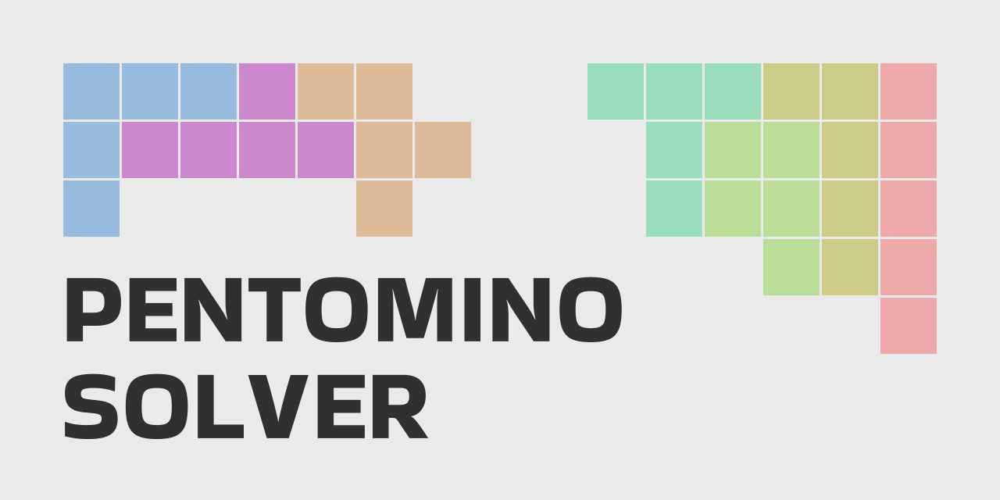

<p align="center">
  
</p>

# Pentomino Solver

**Pentomino Solver** 

## Features


## Future Features

- Menu that allows the user to set pieces and create an initial state for the algorithm to work with.

At the moment, there are no plans to introduce any new features.

## Requirements

Before you begin, ensure you have the following software installed:

- **Java JDK**: Required to compile and run the project.
- Either **Windows** or **MacOS**, depending on the platform you are creating the app for.

## Build Instructions

### 1. Select the platform

Open **build.sh**:

- If you are using Windows: comment the fragment of code that creates the Apple .dmg and leave the .exe
- If you are using MacOS: comment the fragment of code that creates the .exe and leave the .dmg

### 2. Use the Build Script

```bash
chmod +x build.sh
./build.sh
```

### 3. Allow execution

If you are running the program on MacOS you may find an error when you open it. <br><br>
You will have to give your computer permission to run the program from:<br>
``Apple menu`` > ``System Settings`` > ``Privacy & Security`` > ``Security``

On Windows you may need to open it as administrtor.

## License

This project is licensed under the MIT License.

#

**Pentomino Solver** is an open-source project developed by Javier Iregui, 2025.
